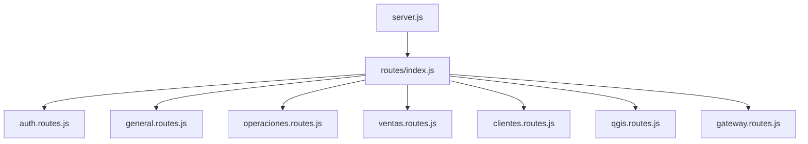

# 🔧 Refactorización del API Gateway - Estructura Modular

## ✅ **Archivos Separados:**

El archivo `index.js` que antes tenía **878 líneas** ahora está dividido en **8 módulos** especializados:

### 📁 **Estructura de Archivos:**

```
src/routes/
├── index.js                 # Router principal (75 líneas) ⭐
├── auth.routes.js           # Autenticación y usuarios (175 líneas)
├── general.routes.js        # Microservicio general (150 líneas)  
├── operaciones.routes.js    # Microservicio operaciones (180 líneas)
├── ventas.routes.js         # Microservicio ventas (90 líneas)
├── clientes.routes.js       # Microservicio clientes (60 líneas)
├── qgis.routes.js          # Servicio QGIS (85 líneas)
└── gateway.routes.js       # Info del gateway (120 líneas)
```

---

## 🎯 **Ventajas de la Nueva Estructura:**

### ✅ **Mantenibilidad:**
- **Un archivo por responsabilidad** - Cada módulo maneja un microservicio específico
- **Fácil localización de errores** - Los problemas se aíslan por módulo
- **Desarrollo paralelo** - Equipos pueden trabajar en módulos independientes

### ✅ **Escalabilidad:**
- **Agregar nuevos microservicios** es tan simple como crear un nuevo archivo `.routes.js`
- **Modificar rutas específicas** sin tocar otros módulos
- **Reutilización de módulos** en otros proyectos

### ✅ **Legibilidad:**
- **Código más limpio** y fácil de entender
- **Documentación específica** por cada módulo
- **Separación clara de responsabilidades**

---

## 📋 **Descripción de Módulos:**

### 🔐 **auth.routes.js**
```javascript
// Maneja:
- Micro Login Users (nuevo)
- Sistema Legacy de autenticación  
- Rutas de usuarios y roles
- Tokens JWT y validaciones
```

### 📄 **general.routes.js**
```javascript
// Maneja:
- Documentos
- Hojas de cálculo  
- Notas inteligentes
- Publicaciones
- Enlaces externos
```

### ⚙️ **operaciones.routes.js**
```javascript
// Maneja:
- API v2 (esquema operaciones)
- Proyectos y tracking
- Rutas legacy para compatibilidad
- Reescritura de URLs
```

### 💰 **ventas.routes.js**
```javascript
// Maneja:
- Operaciones de ventas
- Reportes financieros
- Facturación
```

### 🏢 **clientes.routes.js**
```javascript
// Maneja:
- Gestión de clientes
- Contactos e interacciones
- Segmentación
```

### 🗺️ **qgis.routes.js**
```javascript
// Maneja:
- Renderizado de planos
- Generación de PDFs GIS
- Health checks públicos y protegidos
```

### 🚀 **gateway.routes.js**
```javascript
// Maneja:
- Información del sistema
- Status y health checks
- Documentación de endpoints
```

---

## 🔄 **Flujo de Configuración:**



---

## 🛠️ **Cómo Agregar un Nuevo Microservicio:**

### **1. Crear archivo de rutas:**
```bash
touch src/routes/nuevo-servicio.routes.js
```

### **2. Implementar estructura:**
```javascript
import express from 'express';
import { createProxyMiddleware } from 'http-proxy-middleware';

export default function createNuevoServicioRoutes(SERVICES) {
    const router = express.Router();
    
    // Configurar rutas aquí
    
    return router;
}
```

### **3. Registrar en index.js:**
```javascript
import createNuevoServicioRoutes from './nuevo-servicio.routes.js';

// En createRoutes():
router.use('/', createNuevoServicioRoutes(SERVICES));
```

### **4. Agregar servicio en services.js:**
```javascript
NUEVO_SERVICIO: {
    name: 'nuevo-microservicio',
    baseUrl: process.env.NUEVO_SERVICE_URL || 'http://localhost:XXXX',
    routes: ['/api/nuevo/*']
}
```

---

## 📊 **Estadísticas de Refactorización:**

| Métrica | Antes | Después | Mejora |
|---------|-------|---------|--------|
| **Archivo principal** | 878 líneas | 75 líneas | **91% reducción** |
| **Archivos de rutas** | 1 | 8 | **8x modularidad** |
| **Líneas por módulo** | N/A | 60-180 | **Tamaño manejable** |
| **Tiempo de localización** | Muy Alto | Bajo | **Búsqueda rápida** |
| **Mantenibilidad** | Difícil | Fácil | **Desarrollo ágil** |

---

## 🎉 **Resultado Final:**

✅ **Estructura totalmente modular y escalable**  
✅ **Fácil mantenimiento y desarrollo**  
✅ **Preparado para crecimiento futuro**  
✅ **Código limpio y bien documentado**

**¡El API Gateway ahora es mucho más profesional y mantenible!** 🚀